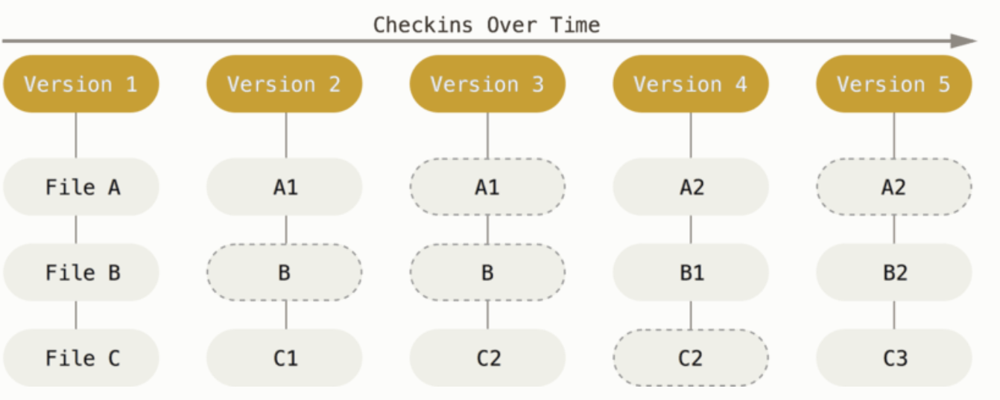

# git基础
整理了一些平时工作时使用git的基础知识,理清楚每个概念,使用起来才能更加顺手和淡定.
## git存储方式
git在每次提交更新的时候,将所有文件制作一个快照并保存这个快照的索引,为了高效,如果文件没有修改，git不会再重新存储该文件，而是只保留一个链接指向之前存储的文件.




## git工作流

### 工作区域
git有4个工作区域,分别是
```
本地仓库:repository
暂存区:index
远程仓库:remote
工作区:workspace
```


[仓库]就是保存所有信息的地方

[工作区]就是某个版本对应的内容,放在磁盘中供我们修改.

[暂存区]是保存即将被提交的文件快照信息.

git中的工作流如下

```
1.在工作区中操作文件
2.暂存,将文件快照放入暂存区(git add)
3.提交,将暂存区的所有快照信息,永久地保存到本地仓库中(git commit)
```
对应的命令流程
```
git add .
git commit -m ‘message’
git push
```
其中push命令将本地代推送到远程仓库,这样协作人员通过pull的方式,拉到他自己的本地仓库和工作区,实现代码的同步和分享.


### 文件状态

由此可以发现,文件的状态有
```
[workspace]未修改/已修改/未跟踪
[index]已暂存
```
我们平常可以经常用git status来查看文件的状态,如何转变文件状态就是工作流中对应的命令.


### commit

从上面我们知道,每次提交都是根据暂存区的快照信息,对所有的文件进行快照存储,存储的信息根据内容经过算法(SHA-1散列/hash)形成一个哈希值(这是一个由 40 个十六进制字符（0-9 和 a-f）组成字符串),这个值就是commitId.


commitId是一个很重要的信息,根据这个值找到每次快照的具体内容,而我们所谓的分支/tag也都是指向commitId.


## git分支管理

从原理我们知道,提交就是一个个指向快照的索引,而git的分支则是一个个指向commit的指针,它存储的值就是commitId.


其中HEAD则是一个特殊的指针,它指向了当前所在的位置.

所以新建和删除分支,不过是增加和减少指针而已
```
git checkout -b test
```


### 分支合并
分支开发最重要的问题就是分支的合并,git在合并分支的时候,会对比两个快照之间差异,自动进行合并,如果遇见冲突,则会中断,认为解决冲突后再继续进行下去.

而合并有几种方式可以选择,
```
git merge
git rebase
git cherry-pick
```
而其中merge又分为3种模式
```
fast-forward
no-ff
squash
```
### fast-forward
当分支只有增加的提交,没有交叉时,使用的时快速合并,相当于把master指针移动到test

```
git merge test
```


### no-ff
fast-forword有个缺点是会丢失分支信息,比如有个功能,几分钟就搞定了,马上将分支合并回去,这个时候如果没有人在master分支提交东西就会进行快速合并.

但是从管理的角度,我们有时候希望在线条上能够保留分支信息,便于查看开发过程.这个时候该怎么办,no-ff就派上用场了,这个参数会产生一个新的提交,保留了分支合并的信息
```
git merge –no-ff test
```


### squash

这个参数之前一直都没使用过,他的意思是直接在当前分支新建一个节点.这个有个很大的缺陷就是不仅丢失了分支信息,连中间提交的信息都没掉了.
```
git merge -squash test
```


### rebase
在和其他人进行协作操作同一个分支的时候,很经常会发生的情况是,你本地的提交还没来得及推送,远程就有人推送了代码,这个时候,推送会失败,git会提示你先进行pull,而pull其实跟merge是一个道理,将远程分支merge到本地的分支.

通过前面我们知道,这种交叉的合并是会产生一个新的提交的,这样的最终代码的结果并没有什么问题,问题在于,线条变得杂乱,有很多条合入的线,而这些线并没有任何的意义.

为了避免这个问题,我们发现了另外一种合并的方式,git rebase,rebase叫做变基,其原理是,把两个分支共同的祖先之后的提交,在当前分支上重演一遍.


从图中可以发现,A1是master和test共同的祖先,护着说test就是从A1捡出来的分支,B1和B2则是待合入的提交,结果是B1和B2被遗弃了,新建了两个替身被合并到了当前分支上.(B1/B2最终会被回收)

合并的结果就是不会有很多无用的线条,而是一条直线.

### cherry-pick
这是个神器,特别是当产品突然说上哪个需求,但是你已经合并了多个功能分支的时候.

这个命令可以单独合并某个节点过来,结果是将节点变成一个新的节点在当前分支提交.
```
git cherry-pick commitid
```
## git日志
```
git log
```
git日志可以打出每次提交的具体信息,包括commitid

git还有一个特殊的日志,head变动日志,这个在回滚的时候特别有用,可以找回你以为丢失的东西

```
git reflog
```

## git的后悔药
我们在操作git的时候,难免会犯错,但现在理解了每个文件的状态和各个工作区域的职责,我们就安心的多.不必太慌张,因为所有的信息都会被git记录,不担心找不回来.

对于文件状态的回退,有几种常用场景

#### 针对工作区
checkout操作,将文件回退到暂存区或者仓库的状态.

1.指定文件名

当文件在暂存区有快照信息时,文件将恢复到与暂存区相同,如没有则与仓库相同,其实就是拿暂存区或者仓库的文件快照来覆盖工作区的文件内容
```
git checkout file // 取消工作区的修改
git checkout branch|commitid|tag file // 从指定快照中拿文件过来覆盖
git checout . // 所有文件取消工作区修改
```
2.指定分支名
```
git checkout test
```
分支则切换分支
```
将head移动到test
暂存区和工作区的内容将对比新test节点中的内容,对比到内容一致,其中不存在的文件就删除.
```


当然也可以指定tag或者commitid,这个时候加一个名字,就变成一个新的分支

#### 针对暂存区
reset操作

1.从暂存区恢复到工作区继续修改
```
git reset HEAD file
```
2.放弃暂存区和工作区,回滚到指定提交
```
git reset --hard commit
```
#### revert
```
git revert commitId
```
也是版本回滚,但是这个回滚是新增一个提交,内容是取消是该提交的修改信息.

## git的一些小技巧

### 清除未跟踪的文件
```
git clean -f
```
### 清除不存在的远程分支
```
git remote prune origin
```

## 总结

用以下这张图结束今天的分享,并附上常用git的命令清淡,以备查询.


git是个超级赞的工具,提倡热爱命令行.
