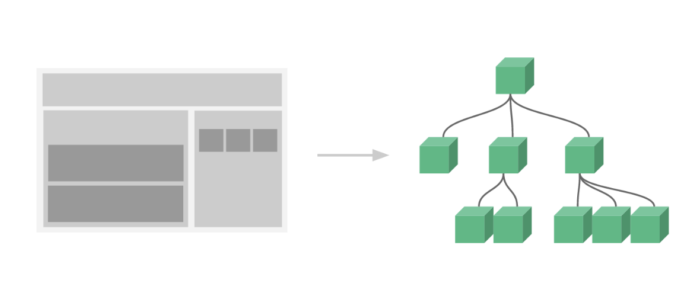
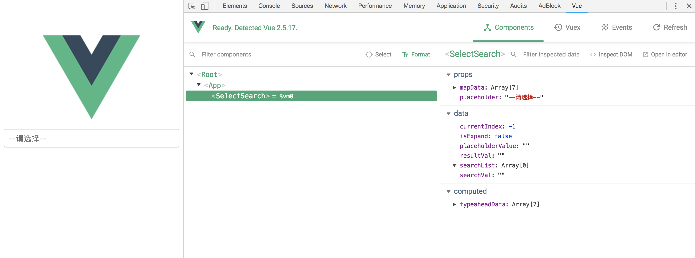
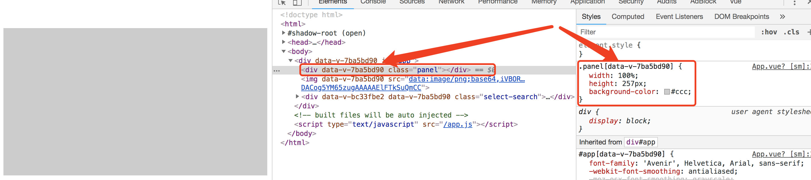

# 漫谈vue组件开发

组件作为vue描述页面的方式,是vue核心内容之一.经过将近一年的vue项目开发,开发过各种类型的组件,也形成了一套自己组装vue组件的思路,遂以此为题,总结经验.

## 为什么组件化
人的大脑处理信息的能力是有限的,面对一个有复杂度的东西,要想一口气理清并不容易.即使你足够聪明能够一次性处理这些复杂逻辑关系,如何让你的小伙伴理解,并进行后期维护和拓展,也是一项艰难的问题.

但是,人虽然不能一次性处理掉复杂逻辑,但是人擅长于处理关系.什么意思呢,就是如果将一个复杂的需求,拆分成一个个小而独立的需求,然后再让你去指挥它们完成这个复杂需求,就相对容易的多.也就是所谓的化整为零,各个击破.

所以体现在vue上面就是用棵组件树来描述用户界面,这棵树由各种组件堆叠而成.每个组件都是一个个vue实例,拥有自己的属性和方法,可以渲染出界面某一个区块.于是我们的关注点就从一个大而杂的页面,变成关注一个个小而简单的组件.



## 如何组织组件
组件化是一种抽象，如何使用和落实它影响着组件化的效果。这里，我们将这颗组件树上的组件分为3种类型：
  1. 基础组件
  2. 业务组件
  3. 页面组件

### 基础组件
基础组件也可以说成是通用组件，意思是它不为业务所限，在多个应用中都能找到应用场景。例如小小的一个Button组件、Input组件，或者大一点的Table组件、Menu组件等等。这类组件通过极致的抽象，互相独立，功能完善，脱离业务，作为每一个系统的基础而存在。而且，当你觉得某个组件不足以支撑你的野心，你完全快速的替换掉它并且不影响其他组件运行。

当然，这类组件的越是完善，构建一个系统就越是便捷和简单。而且，我们通过规范组件样式，统一组件架构，将这类组件规划在一起的时候，就变成了一个我们熟悉的词-组件UI库。目前大热的element-ui、iview等都是vue组件UI库的典范。

### 业务组件
当然，每个公司，甚至每个项目都有属于自己的特色的业务。比如CDN业务中很常见的域名选择，动则上十几万的域名数据，且在筛选时需要根据不同条件去进行，按照目前ui库提供的select组件根本无法满足，只能根据这个业务需要，专门做一个组件来方便用户使用。

从这边可以看出来，业务组件相对于基础有一大特点：业务强关联，应用场景受限

### 页面组件
页面组件，可以将其形容为组件的容器，是所有基础组件、业务组件的上级组件。一般，一个页面组件对应一个路由，所以也可以称之为路由视图组件。

那这3类组件最终组成了组件树上的各个节点，页面组件包含业务组件和基础组件，业务组件又包含有基础组件。

## 组件开发
了解大概念的组件化，我们将目光往单个组件上转移。

组件开发从3个方面去讲，一是工具，二是构成，三是实践。

### devtool
工欲善其事，必先利其器。因为.vue文件最终都被编译成js了，所以要调试真的很麻烦。我一开始的方法是在要看状态的地方，打一个console，然后再按着这个console来找到文件，然后设置断点调试，但是又看不到真个组件的全貌。

后来才发现devtool这个chrome插件，真的是神器，不仅可以直观的看到组件树，查看每个组件当前的状态，还能看vuex和事件调用。这样调试起来就顺手的多。   




### 构成
首先，我们将组件划分为几个模块，来看组件的构成
1. 外观
2. 数据状态
3. 事件通讯
4. 内部逻辑
```html
<!-- 外观：template/slot/style -->
<template>
  <div class="panel">
    <slot></slot>
  </div>
</template>

<style>
.panel {
  width: 100%;
  height: 257px;
}
</style>
```
```javascript
export default {
  // 数据状态相关
  props: {},
  data () { return {} },
  computed: {},
  
  // 逻辑处理相关 
  watch: {},
  created () {},
  methods: {
    handleAdd () {
      this.$emit('on-add') // 事件通讯
    }
  }
}
```

#### 外观
前面说过，组件负责着页面某一块内容逻辑交互和渲染，所以一般组件都会有自己的渲染内容，这块就是外观，主要由template/css/slot组成，其中slot是交给外部来填充的内容。

这边需要注意的一个点是 __样式必须限制作用域__：

因为.vue文件允许我们将template写在同一个文件里面，方便而且直观，这就可能会引导大家都将样式写在组件里。但是呢，有些样式可能是本组件才需要的，我们不希望它影响到其他组件，特别是直接对标签的样式定义。然而因为组件的样式最终会被编译到同一个style文件里，变成全局的样式，所以就会影响到其他组件的样式。

所以，我们倡导写组件样式有两种：
1. 单文件组件内的样式加scoped
2. 每个组件一个单独的样式表，并以组件名作为前缀

第一点，样式加上scoped，最终dom上的节点还有相应的样式，都会被加上data-v-hash来区分作用范围。
```html
<template>
  <div class="panel"></div>
</template>

<style scoped>
.panel {
  width: 100%;
  height: 257px;
  background-color: #ccc;
}
</style>
```

第二点，是我比较推荐和倾向的，特别是对基础组件，一个单独的样式表和前缀，让样式编写更加优雅。关于前缀的命名，一般是直接使用组件名称作为前缀。

#### 数据及其管理
模板的展示结果是根据状态来的，而这些状态就是组件里面的数据。组件的数据来自3个选项：props、data、computed。

其中：props来自于外部、data为自定义变量、computed为计算结果
以下是关于数据处理的几个技巧：
##### （1）承接props的3种方式
我们拿到数据后可能用途有3种，分别对应不同的处理方式
1. 只拿来用-直接使用
2. 作为局部变量使用（一般是需要修改数据）- data上定义变量，并将props赋值给它
3. 需要处理后使用 - 用computed计算后返回

> 当数据需要变成局部变量来使用，并且props格式是个引用类型的话，一定要进行深度克隆，原因大家都懂的。

##### （2）往外传递数据
组件往外传递数据的方式只有一种，那就是事件。

所以组件的组件的通讯还可以总结为 __props down, event up__

即使是v-model，也是通过事件来实现的：
```javascript
export default {
  props: {
    value: {
      type: String,
      default: ''
    }
  },
  data () {
    return {
      curVal: this.value
    }
  },
  methods: {
    handleChange () {
      this.$emit('input', this.curVal)
    }
  }
}

```
##### （3）computed使用姿势
其实我更喜欢称computed为衍生数据，它有两大使用场景
1. 衍生数据：通过props、data，组合运算生成新的数据
2. 代理数据：定于get用来衍生取数据，set用来修改数据时，映射并更新到它的衍生
```javascript
export default {
  data () {
    return {
      params: {
        statrTime: '',
        endTime: ''
      }
    }
  },
  computed: {
    time: {
      get () {
        return `${this.statrTime}-${this.endTime}`
      },
      set (val) {
        const time = val.split('-') || []
        this.params.statrTime = time[0]
        this.params.endTime = time[1]
      }
    }
  }
}
```
##### （2）computed or watch
其实watch做得事情跟computed很像，都是根据数据变化触发的，但是呢，两者有很大的不一样：

1. computed是多对一，也就是适用于监听多个数据变化来生成一个数据，而watch是一对多，监听一个数据状态的变化，进而处理其他数据。
2. computed只用来生成数据，不建议做其他处理，而watch可以，无论是修改数据还是处理其他事情。

#### 事件
组件内的事件，一般用于通讯。

##### 表单组件要实现v-model
说到组件，就不得不提v-model，当我们在设计一个表单类组件的时候，比如时间选择框，一定要实现v-model，方便数据的双向绑定。
##### 优先使用事件而不是回调
其实用prop传递回调函数和用event效果是一样的，但是他们有个意义上的区别：

prop是父组件给子组件的数据，而event是子组件给父组件数据

这边所说的优先使用事件，想要达到一个效果就是明确的区分这两者，就是我从别人那边拿的数据就是在props上，而我传递出的消息就是在emit里面找。
```javascript
export default {
  props: {
    data: {
      type: String,
      default: ''
    }
    // afterChange: { // 不推荐
    //   type: Function
    // }
  },
  data () {
    return {
      curVal: this.data
    }
  },
  methods: {
    handleChange () {
      // this.afterChange(this.curVal) // 不推荐
      this.$emit('on-change', this.curVal)
    }
  }
}
```

#### 逻辑
当我们定义好外观和对外的数据交互，剩下就是内部逻辑实现了，这部分由主要由使用methods、声明周期、watch来控制数据变化和逻辑。

##### 保持方法功能单一
将复杂的处理过程划分成一个个处理方法用来到处调用，这边要注意的就是保持每个方法单一，不要写太多东西导致代码不清晰。

##### 生命周期
然后是生命周期，我们需要在组件的声明周期的各个节点中做一些事情来，比如组件开始渲染的时候，我们要先从后端拿数据，这就需要在created的时候进行。

### 组件的开发
最后，用实战更直观的了解组件的开发过程。接下来我们实现一个下拉选择组件。这个组件叫做Myelect.

#### 1、理清楚需求
组件开发之前，一定要理清楚需求，了解要实现的功能。

我们对这个下拉选择框设定的需求是：
1. 支持单选
2. 支持多选
3. 支持自定义结果显示
4. 支持筛选
5. 支持清空
#### 2、设计好API
功能确定好后，就要进行API的定义，一个组件的API来自props、slot和events，确定好这部分的规则，其他的就只剩下内部的逻辑实现了。API定义好了可以提高组件的可拓展性，而逻辑跟使用者没关系，一期没做好，也可以在后续的迭代中改进。

从功能出发，这边的api可以设计如下：

props:

props最好都要加类型校验
```javascript
props: {
  value: {
    type: [String, Array],
    default: ''
  },
  data: { // 展示数据, 单个格式为{ value: '真实值', text: '显示用' }
    type: Array,
    default: () => []
  },
  multiple: { // 是否多选，默认为false（即单选）
    type: Boolean,
    default: false
  },
  clearable: { // 是否可以清空，默认false（即不可清空）
    type: Boolean,
    default: false
  }
}
```
slot:

为了实现选中结果的自定义，加一个slot用于展示
```html
<template>
  <div class="my-select">
    <div class="my-select__head">
      <slot></slot>
    </div>
  </div>
</template>
```
event:

建议自定义事件都加on-前缀，以跟原生事件分开
```
input // 用于实现v-model的
change // 用于触发表单验证的
on-change
```
#### 3、组件初始化
这边就要用到我们之前将的props数据的处理方式了
```html
<template>
  <div></div>
</template>
```
```javascript
export default {
  ...
  data () {
    return {
      currentVal: [this.value],
      key: ''
    }
  },
  computed: {
    selectedList () {
      return this.data.filter(item => this.currentVal.indexOf(item.value) > -1)
    },
    resultData () {
      return this.data.filter(item => item.text.indexOf(this.key) > -1)
    }
  },
  watch: {
    value (val) {
      this.currentVal = [val]
    }
  }
  ...
}

```
#### 4、处理好逻辑
```javascript
export default {
  ...
  methods: {
    handleSelected (item) {
      this.$emit('input', [].cancat(this.currentVal, [item.value]))
    }
  }
  ...
}
```